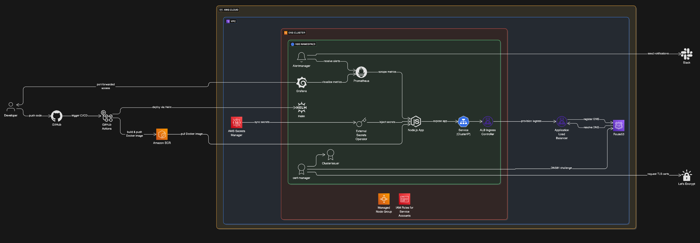

# DevOps-Take-Home

## Architecture Diagram



## Architecture Overview

- **Application**: Node.js app running on port 3000, containerized with Docker.
- **Infrastructure**: Managed with Terraform, including EKS cluster, IAM roles, and supporting AWS resources.
- **Kubernetes**: Helm chart for deployment, service, ingress, and secret management.
- **Secrets Management**: Uses External Secrets Operator to sync AWS Secrets Manager secrets into Kubernetes.
- **Monitoring & Alerting**: Prometheus and Alertmanager (Helm values in `infrastructure/Helm-values/1-alert-manager.yaml`), with Slack integration for alerts.
- **CI/CD**: GitHub Actions pipeline for build, push to ECR, and deployment to EKS.

---

## Repository Structure

- `app/`
	- `Dockerfile`: Node.js app containerization.
	- `server.js`, `package.json`: Application code.
	- `helm-chart/`: Helm chart for Kubernetes deployment.
		- `templates/`: Deployment, Service, Ingress, etc.
		- `values.yaml`, `values-dev.yaml`: Helm values for different environments.
- `infrastructure/`
	- `*.tf`: Terraform code for AWS infrastructure.
	- `Helm-values/`: Monitoring/alerting Helm values.
- `.github/workflows/deploy-to-eks.yaml`: CI/CD pipeline.◊

---

## How to Deploy

### Prerequisites

- AWS account with admin access
- AWS CLI, kubectl, Helm, Terraform, Docker installed
- GitHub repository secrets for AWS credentials

### 1. Clone the Repository

```sh
git clone <your-fork-url>
cd DevOps-Take-Home
```


### 2. Infrastructure Provisioning (Terraform)

Before running Terraform, configure your AWS credentials. You can do this in one of the following ways:

- **Using environment variables:**
	```sh
	export AWS_ACCESS_KEY_ID=your-access-key-id
	export AWS_SECRET_ACCESS_KEY=your-secret-access-key
	export AWS_DEFAULT_REGION=us-east-1
	```
- **Or using the AWS CLI profile:**
	```sh
	aws configure
	# Follow the prompts to set your credentials and region
	```

Then run:
```sh
cd infrastructure
terraform init
terraform apply
```
- This will create EKS, IAM roles, and other AWS resources.


### 3. Build and Push Docker Image

#### GitHub Actions Secrets and Variables Setup

Before running the CI/CD pipeline, configure the following in your GitHub repository:

1. **Add repository secrets:**
	- `AWS_ACCESS_KEY_ID`: Your AWS access key ID
	- `AWS_SECRET_ACCESS_KEY`: Your AWS secret access key

2. **Add a repository variable:**
	- `Account_ID`: Your AWS account ID (e.g., 123456789012)

Go to your GitHub repo → Settings → Secrets and variables → Actions to add these.

These are required for authenticating to AWS and tagging/pushing the Docker image to ECR.

The CI/CD pipeline (GitHub Actions) will:
- Build the Docker image from `app/Dockerfile`
- Push to ECR (repo auto-created if missing)
- Deploy to EKS using Helm

You can also do this manually:
```sh
cd app
docker build -t <account-id>.dkr.ecr.<region>.amazonaws.com/hello-world-js:<tag> .
# Authenticate and push to ECR
```

### 4. Deploy Application with Helm

```sh
cd app/helm-chart
helm upgrade --install hello-world-js . \
	--set image.repository=<account-id>.dkr.ecr.<region>.amazonaws.com/hello-world-js \
	--set image.tag=<tag> \
	--values values-dev.yaml
```


### 5. Configure External Secrets

- For the demo app to work, you must create a secret in AWS Secrets Manager named:
	- `demo-project/rds-creds`
	- This secret must contain a key called `password` with your desired value.
- The External Secrets Operator will sync this secret into Kubernetes (see `values-dev.yaml` under `externalSecrets`).

---


## Monitoring & Alerting

- **Prometheus & Alertmanager**: Deployed via Helm (see `infrastructure/Helm-values/1-alert-manager.yaml`).
- **Dashboards**: Access via the Prometheus/Alertmanager web UIs.
	- To access Grafana (if deployed), run:
		```sh
		kubectl port-forward svc/grafana 3000:80 -n monitoring
		# Then open http://localhost:3000 in your browser
		```
	- To check CPU usage for a pod:
		```sh
		kubectl top pod -n <namespace>
		# Or for all pods:
		kubectl top pods --all-namespaces
		```
- **Alerting**: Alerts are sent to Slack (`#oncall-devops` channel, webhook configured in Alertmanager values).

---

## How to Check

- **App Health**: Liveness/readiness probes on `/` at port 3000 (see `values-dev.yaml`).
- **Kubernetes**: `kubectl get pods`, `kubectl get svc`, `kubectl get ingress`
- **Monitoring**: Prometheus/Alertmanager dashboards
- **CI/CD**: GitHub Actions workflow status

---

## Replication Instructions (New AWS Account)

1. **Fork and Clone the Repo**
2. **Set up AWS credentials** in GitHub repository secrets:
	 - `AWS_ACCESS_KEY_ID`
	 - `AWS_SECRET_ACCESS_KEY`
3. **Provision Infrastructure** with Terraform as above.
4. **Update `values-dev.yaml`**:
	 - Change all occurrences of the AWS account ID (e.g., in IAM role ARNs, domains, and annotations) to match your new AWS account.
	 - Update the ECR repository, domain, and any other account-specific values as needed.
	 - Update the `clusterIssuer` section:
		 - `name`: (optional) Name for the ClusterIssuer resource.
		 - `email`: Your email for Let's Encrypt notifications.
		 - `privateKeySecretName`: (optional) Name for the secret storing the ACME account key.
		 - `region`: AWS region for Route53 DNS01 challenge.
		 - `hostedZoneID`: Your Route53 Hosted Zone ID for the domain you want to secure.
5. **Push code to main branch** to trigger CI/CD, or deploy manually with Helm.
6. **Set up AWS Secrets Manager** with required secrets.
7. **Access the app** via the ALB DNS or your configured domain.

---

## File Reference

- **Infrastructure code**: `infrastructure/*.tf`
- **CI/CD config**: `.github/workflows/deploy-to-eks.yaml`
- **Dockerfile**: `app/Dockerfile`
- **Kubernetes manifests**: `app/helm-chart/templates/`
- **Monitoring/alerting**: `infrastructure/Helm-values/1-alert-manager.yaml`